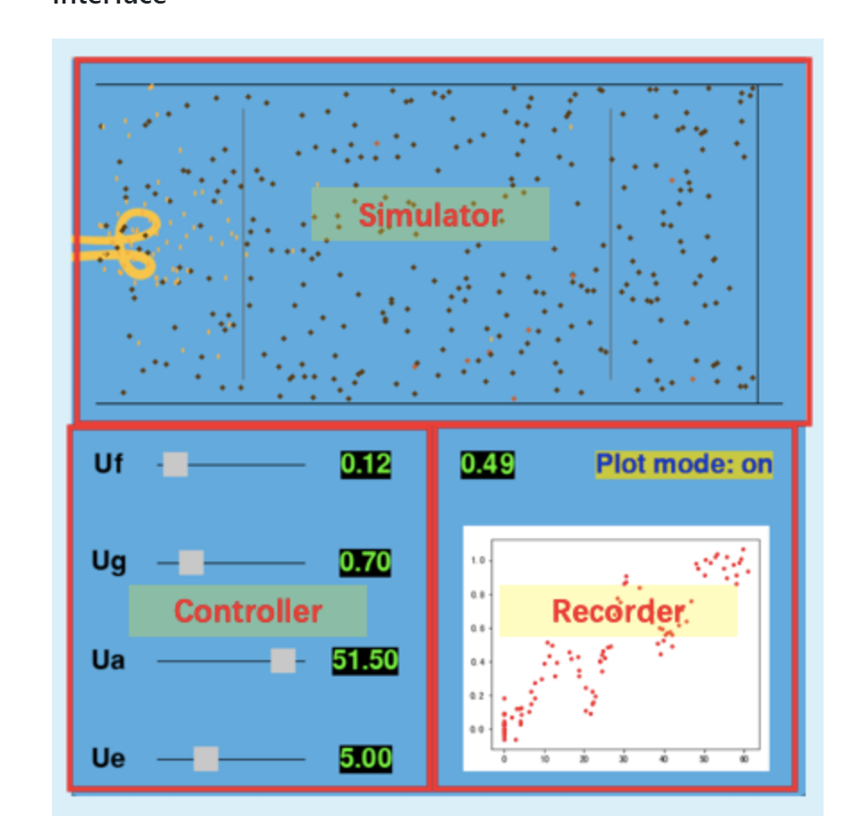

## Frank‑Hertz 实验仿真动画

这是一个用于演示与交互探索弗兰克—赫兹（Frank–Hertz）实验物理现象的可视化仿真程序。
界面将粒子、碰撞、以及板极电流的伏安关系直观地呈现，支持对气体种类、各类电压和磁场参数的实时调节。

**主要功能**

实时粒子仿真（电子与原子）并显示辉光带与粒子碰撞效果。

记录到达收集极的电子，计算并绘制板极电流的伏安曲线（可平滑显示）。

支持多种气体（Hg、Ar、Ne、He）参数配置。

可独立控制“纵向（轴向）磁场”和“横向磁场”，并观察它们对电子轨迹、辉光带和伏安曲线的影响。峰/谷检测：在绘图区域标注并列出检测到的所有局部峰与谷的坐标（Ua, Ie）。

**运行依赖**

Python 3.8+（推荐使用虚拟环境）

pygame

在 Windows + Anaconda 下的一个简单运行示例：

```powershell
python main.py
```

（若缺少依赖，请先 `pip install pygame`）

**效果说明（界面提示）**

左侧为电压控制滑块（Uf、Ug、Ua、Ue），可通过滑块或界面按钮修改。

右侧为磁场控制：纵向/横向的档位为 0、5、10、15、20、25 mT（步进 5 mT），强度为 0 时视为关闭。

中央绘图区显示伏安曲线，曲线上会标注峰/谷位置，并在右上角列出坐标数值，便于读数与分析。

**开发者备注（内心独白）**
说句真心话：我本来是不打算做这个的，奈何甲方可爱，比赛又是我让她参与的——结果只好接锅上阵。
这活儿倒像是“搬起石头砸自己的脚”：源码是从 GitHub 拉来的框架，初来乍到简直处处不通顺，像一张未经打磨的粗糙手稿。
我花了不少时间把它一点点改成能用的模样：有的地方改的个人认为还行，有的地方只能权宜之计，能跑起来就算万幸。

开发过程中充满了“欲速则不达”的无奈与“锲而不舍”的倔强：
我硬是给本来散乱的点状图做了四重滤波，把散点努力磨成了看得过去的曲线；为满足额外的磁场创新需求，还得抠图、调参，头都大了。不信你可以看看原来的图：


说实话，这东西能在最终成型，更多靠的是耐心与妥协，也是我实在没招了。

别以为我会美化这些艰难：我从不会 Python 开始，装软件、配置环境、补库、改代码，每一步都像在和未知握手。好在“豆包”给了思路（感谢），要不是这些破玩意，我看半天也看不懂。

一句话总结：能跑起来已经很不容易了，但也恳求未来的需求不要再惊天动地了。

OS:我绝对不会再改了

**贡献与致谢**

本项目改造自开源项目（源码来自 GitHub），在此感谢原作者的框架设计。

感谢在调试中给予建议与帮助的朋友与工具。

---
